[English version here!](./README.md)

# Led7seg Counter with HC595 

Thiết kế bộ đếm 4 led 7 đoạn (0-9999). Giao tiếp Verilog qua ic thanh ghi dịch HC595.

## I. Tác giả

- **Name:** Võ Nhật Trường
- **Email:** truong92cdv@gmail.com
- **GitHub:** [truong92cdv](https://github.com/truong92cdv)

## II. Kết quả demo

https://github.com/user-attachments/assets/e14f3003-0783-4027-b96c-c62e5e2e1b5a

## III. Thiết bị

- ZUBoard 1CG mã **XCZU1CG-1SBVA484E**.
- Led7seg 4 số có tích hợp 4 ic HC595.
- 3 đường dây tín hiệu SRCLK, RCLK và SER; dây VCC +5V; dây GND.

Trên thị trường có 4 loại module led7seg 4 số thông dụng, tương ứng mỗi loại thì giao tiếp với Verilog cũng khác nhau:
1. Led 7 đoạn đơn thuần. Cần đến 12 chân giao tiếp.
   
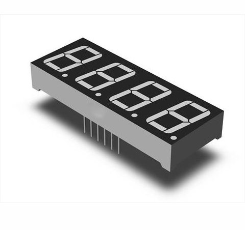

2. Led 7 đoạn tích hợp ic TM1637. Dùng 2 chân giao tiếp CLK và DIO
   
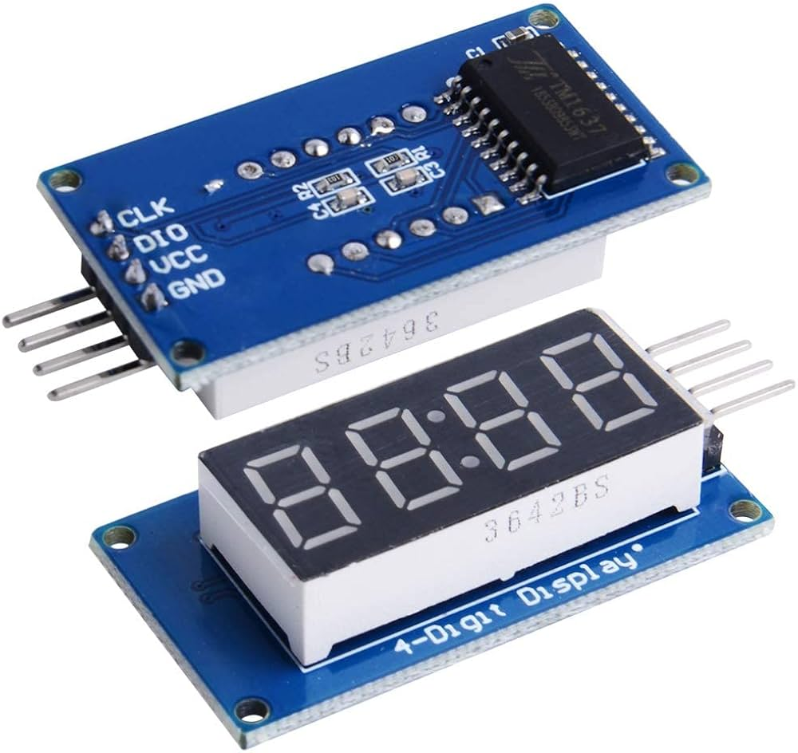

3. Led 7 đoạn tích hợp 2 ic HC595. Trong đó, 1 ic điều khiển các đoạn led A -> DP, 1 ic để chọn led. Dùng 3 chân giao tiếp SRCLK, RCLK, SER.
   
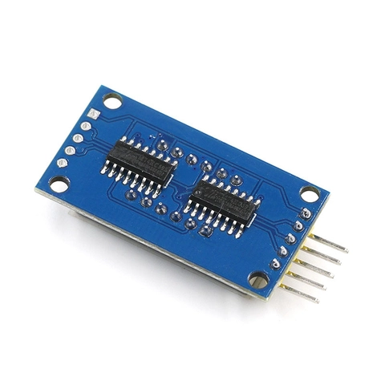

4. Led 7 đoạn tích hợp 4 ic HC595. Mỗi ic điều khiển 1 led riêng biệt. Dùng 3 chân giao tiếp SRCLK, RCLK, SER.
   
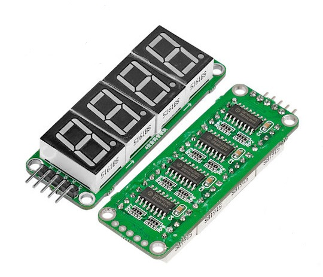

Trong bài này tôi dùng loại thứ 4.

## IV. HC595

HC595 là 1 ic thanh ghi dịch 8 bit. Đọc thêm về hc595 tại đây [HC595](https://dientutuonglai.com/tim-hieu-74hc595.html)

Dữ liệu được gửi đến hc595 theo từng bit tại mỗi cạnh lên xung clk. Khi đã gửi đủ 8 bit, kéo chân RCLK (hoặc ST_CP) lên mức cao để chốt dữ liệu đến đầu ra Q0 -> Q7 (hoặc QA -> QH).

Một ưu điểm của hc595 là nó có thể xếp tầng để điều khiển hơn 8 đầu ra, bằng cách kết nối chân Q7' (hoặc QH') của ic phía trước với chân SER của ic phía sau.

Sơ đồ cấu tạo của HC595 như sau:

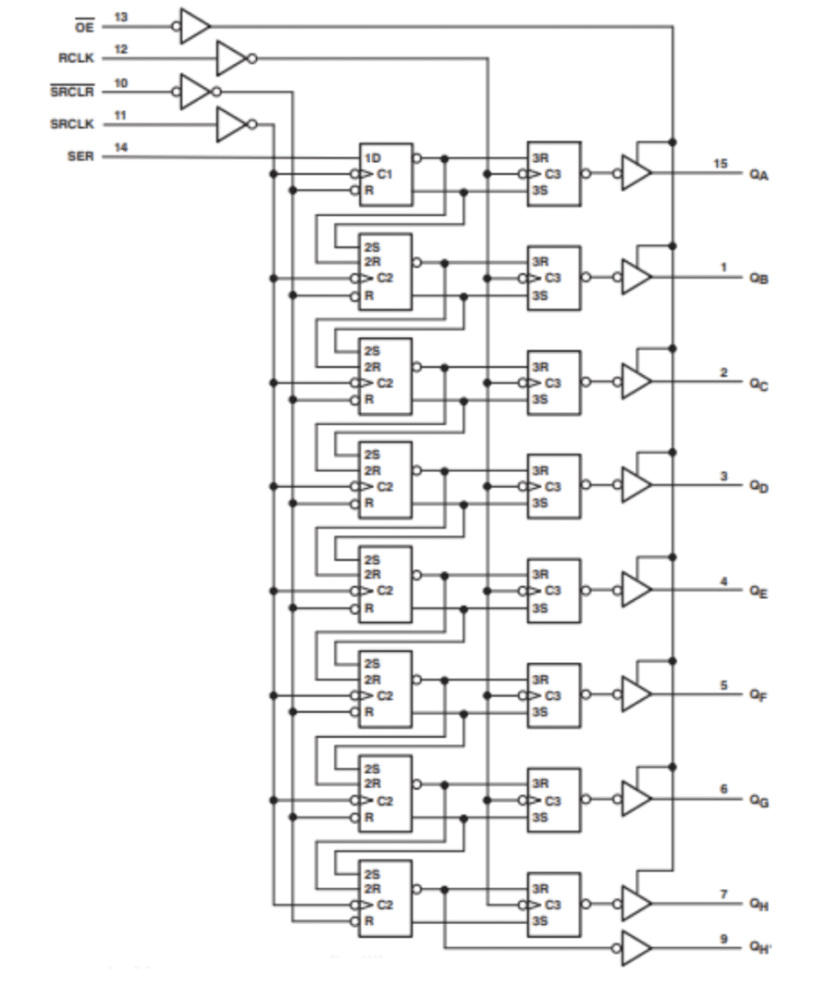

Module 4 led 7 đoạn của chúng ta gồm 4 ic hc595 xếp tầng theo sơ đồ sau:

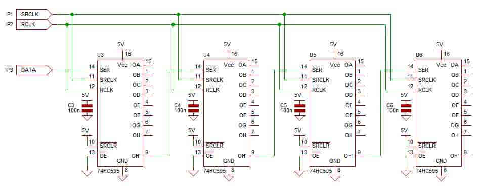

Như vậy để điều khiển 4 led, ta cần gửi cả 32 bit dữ liệu rồi mới kéo chân RCLK lên mức cao để chốt dữ liệu.

## V. Thiết kế các khối chức năng

Chương trình gồm 5 khối chức năng chính:
1. Khối **clk_divider**: chia clk 100 MHz của ZUBoard thành clk 10 Hz (100 ms).
2. Khối **digits**: nhận clk đầu vào 10 MHz, đầu ra là 4 chữ số **dig_0**, **dig_1**, **dig_2**, **dig_3** dưới dạng số thập phân. Các số này đếm từ 0 -> 9999, tăng lên mỗi 100 ms.
3. Khối **bcd_to_led7seg**: gồm 4 bản sao. Mỗi khối nhận đầu vào là 1 chữ số từ khối **digits**, chuyển nó sang dạng mã hóa led 7 đoạn.
4. Khối **gen_eninput_pulse**: tạo xung **en_input** kích hoạt khối **hc595_driver** hoạt động.
5. Khối **hc595_driver**: nhận đầu vào là 32 bit dữ liệu mã hóa 4 chữ số dạng led 7 đoạn. Tạo các tín hiệu giao tiếp với module 4 hc595 xếp tầng điều khiển 4 led 7 đoạn.

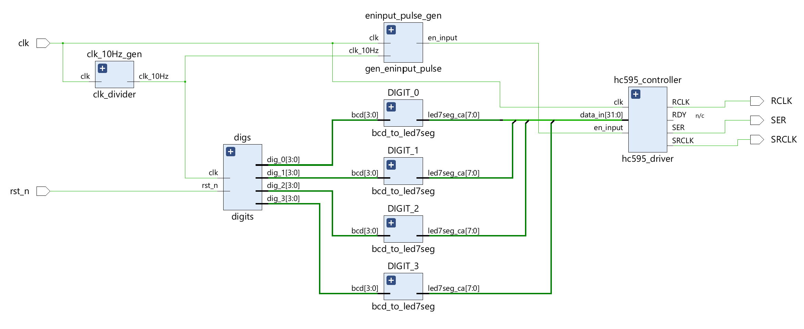

### [1. clk_divider](./src/clk_divider.v)

- Tạo clk 10 Hz (100 ms) từ clk 100 MHz của ZUBoard.

### [2. digits](./src/digits.v)

- Với mỗi cạnh lên xung clk đầu vào 10 Hz, ta tăng **dig_0** lên 1.
- Khi **dig_0 == 9**; set **dig_0 = 0**, **dig_1 = 1**.
- Khi **dig_0 == 9**, **dig_1 == 9**; set **dig_0 = 0**, **dig_1 = 0**, **dig_2 = 1**.
- Khi **dig_0 == 9**, **dig_1 == 9** và **dig_2 == 9**; set **dig_0 = 0**, **dig_1 = 0**, **dig_2 = 0**, **dig_3 = 1**.
- Khi **dig_0 == 9**, **dig_1 == 9**, **dig_2 == 9** và **dig_3 == 9**; reset cả 4 chữ số về 0.

### [3. bcd_to_led7seg](./src/bcd_to_led7seg.v)

- Led 7 đoạn trong bài thuộc loại common anode, đầu vào là 1 chữ số BCD 4 bit, đầu ra là 8 bit mã hóa 8 đoạn led từ DP, G, F, E, D, C, B, A.

### [4. gen_eninput_pulse](./src/gen_eninput_pulse.v)

- Module này nhằm tạo 1 xung kích hoạt khối hc595_driver mỗi 100ms. Xung xuất hiện sau cạnh lên của clk 10 Hz khoảng 10 us, kéo dài 5 us.
- [Testbench code](./tb/gen_eninput_pulse_tb.v)
  
- Waveform:

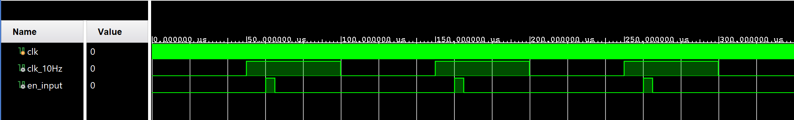

### [5. gen_pulse](./src/gen_pulse.v)

- Khối **gen_pulse** là 1 module con của khối hc595_driver. Mục đích tạo xung đầu ra có thể tùy chính **setup_time** và **pulse_duration**. Xung được kích hoạt khi bật cờ **toggle**. Ta sẽ tạo 2 bản sao của khối này dành cho xung **SRCLK** và **RCLK**. thời gian **setup_time** và **pulse_duration** mặc định là 2 us.

- Ta thiết kế 1 FSM có 4 trạng thái:

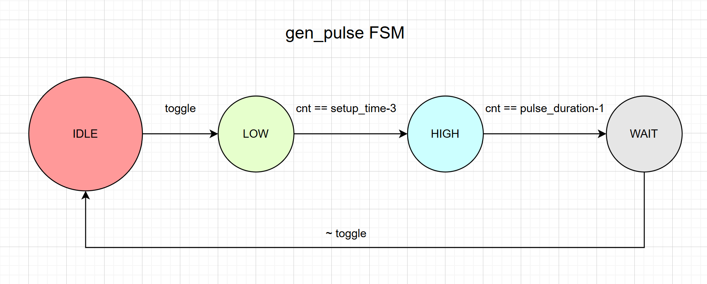

### [6. hc595_driver](./src/hc595_driver.v)

Khối này được thiết kế gồm 3 FSM lồng nhau:
- **main FSM** gồm 3 trạng thái: **IDLE**, **SHIFT**, **LATCH**. Khi có tín hiệu en_input, chuyển trạng thái từ **IDLE** -> **SHIFT**, tiến hành shift từng bit dữ liệu (32 bit). Sau khi hoàn thành shift 32 bit, chuyển sang trạng thái **LATCH**, tạo xung **RCLK** để chốt dữ liệu.
- **sub FSM 1**: FSM con của trạng thái **SHIFT** gồm 4 trạng thái: **PUSH**, **TGL_ON**, **TGL_OFF**, **CHECK**.
- **sub FSM 2**: FSM con của trạng thái **LATCH** gồm 3 trạng thái: **TGL_ON**, **TGL_OFF**, **CHECK**.

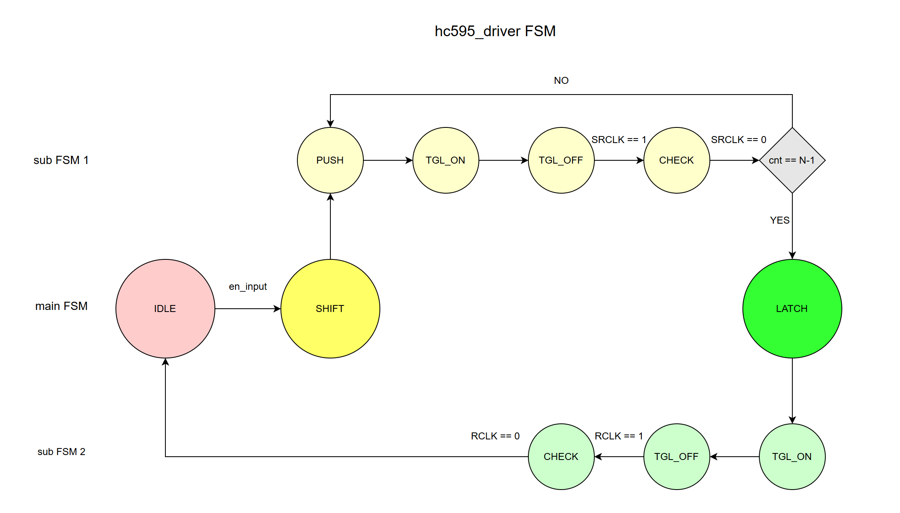

- [Testbench code](./tb/hc595_driver_tb.v)
  
- Waveform:

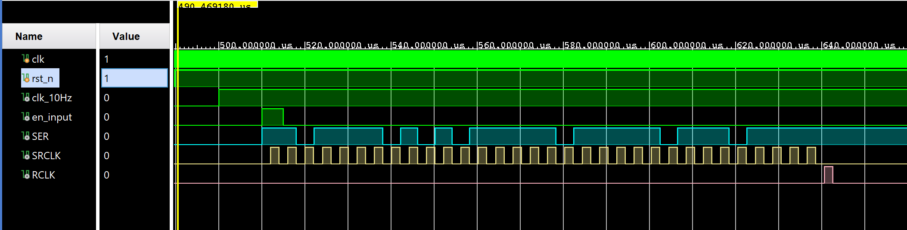

### [7. top](./src/top.v)

Module **top** kết nối các khối chức năng lại theo sơ đồ trên.

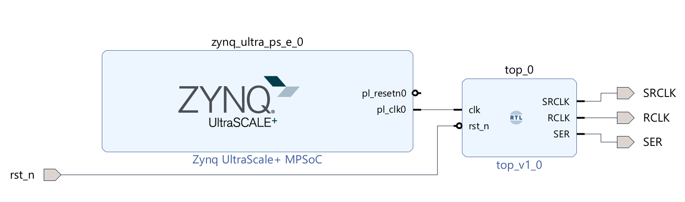

## VI. Tham khảo

1. [HC595 Datasheet](./refs/SN54HC595.pdf)
2. [FPGA_2_ShiftReg](https://github.com/jjcarrier/FPGA_2_ShiftReg)
