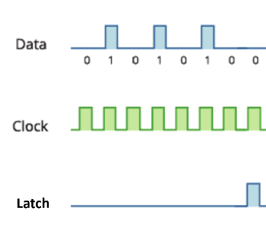
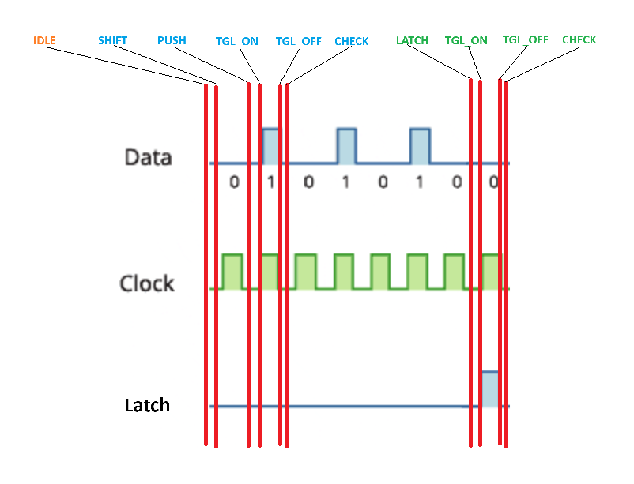

[Vietnamese version here!](./README_VI.md)

# Led7seg Counter with HC595

Design a 4-digit 7-segment counter (0-9999). Verilog communication through the shift register IC **HC595**.

## I. Author

- **Name:** Võ Nhật Trường
- **Email:** truong92cdv@gmail.com
- **GitHub:** [truong92cdv](https://github.com/truong92cdv)

## II. Result

https://github.com/user-attachments/assets/e14f3003-0783-4027-b96c-c62e5e2e1b5a

## III. Equipments

- ZUBoard 1CG code **XCZU1CG-1SBVA484E**.
- **Led7seg** 4-digit display with 4 integrated **HC595** ICs.
- 3 signal lines **SRCLK**, **RCLK**, and **SER**; VCC +5V wire; GND wire.

There are 4 common types of 4-digit 7-segment modules in the market, each interfacing differently with Verilog:
1. Simple 7-segment LED. Requires 12 interface pins.

2. 7-segment LED with integrated **TM1637** IC. Uses 2 interface pins CLK and DIO.

3. 7-segment LED with 2 integrated **HC595** ICs. One IC controls segments A -> DP, the other selects the LED. Uses 3 interface pins SRCLK, RCLK, SER.

4. 7-segment LED with 4 integrated **HC595** ICs. Each IC controls one digit. Uses 3 interface pins SRCLK, RCLK, SER.

In this article, I use the fourth type.

## IV. HC595

**HC595** is an 8-bit shift register IC. Read more about **HC595** here: [HC595 basic](https://lastminuteengineers.com/74hc595-shift-register-arduino-tutorial/).
Refer to the [HC595 Datasheet](./refs/SN54HC595.PDF).

Data is sent to **HC595** bit by bit on each rising edge of the clock signal. After sending 8 bits, pull the **RCLK** (or **ST_CP**) pin high to latch the data to the outputs Q0 -> Q7 (or QA -> QH).

An advantage of **HC595** is its ability to daisy-chain multiple ICs to control more than 8 outputs by connecting the Q7' (or QH') pin of the preceding IC to the **SER** pin of the succeeding IC.

The structure of **HC595** is as follows:

A data transfer frame occurs as follows:

Our 4-digit 7-segment module consists of 4 **HC595** ICs daisy-chained as shown below:

To control 4 digits, 32 bits of data need to be sent before pulling the **RCLK** pin high to latch the data.

## V. Functional Block Design

The program consists of 5 main functional blocks:
1. **clk_divider** block: Divides ZUBoard's 100 MHz clock into a 10 Hz clock (100 ms).
2. **digits** block: Receives a 10 MHz input clock and outputs 4 digits **dig_0**, **dig_1**, **dig_2**, **dig_3** in decimal format. These numbers count from 0 to 9999, incrementing every 100 ms.
3. **bcd_to_led7seg** block: Consists of 4 copies. Each block takes one digit from the **digits** block as input and converts it to a 7-segment LED encoded format.
4. **gen_eninput_pulse** block: Generates an **en_input** pulse to activate the **hc595_driver** block.
5. **hc595_driver** block: Takes a 32-bit input of 7-segment encoded data for 4 digits. Generates signals to interface with the 4 **HC595** ICs to control the 4-digit 7-segment display.

### [1. clk_divider](./src/clk_divider.v)

- Generates a 10 Hz (100 ms) clock from ZUBoard's 100 MHz clock.

### [2. digits](./src/digits.v)

- On each rising edge of the 10 Hz clock input, **dig_0** increments by 1.
- When **dig_0 == 9**, reset **dig_0 = 0**, set **dig_1 = 1**.
- When **dig_0 == 9**, **dig_1 == 9**, reset both to 0 and set **dig_2 = 1**.
- Continue this pattern until **dig_3 == 9**, at which point all digits reset to 0.

### [3. bcd_to_led7seg](./src/bcd_to_led7seg.v)

- The 7-segment LEDs used are of the common anode type. Input is a 4-bit BCD digit, and output is an 8-bit encoding for the segments DP, G, F, E, D, C, B, A.

### [4. gen_eninput_pulse](./src/gen_eninput_pulse.v)

- This module generates a pulse to activate the **hc595_driver** block every 100 ms. The pulse appears about 10 us after the rising edge of the 10 Hz clock and lasts for 5 us.
- [Testbench code](./tb/gen_eninput_pulse_tb.v)
  
- Waveform:

### [5. gen_pulse](./src/gen_pulse.v)

- **gen_pulse** is a submodule of the **hc595_driver** block. It generates output pulses with configurable **setup_time** and **pulse_duration**. The pulse is triggered when the **toggle** flag is set. Two instances of this block are created for the **SRCLK** and **RCLK** pulses. Default **setup_time** and **pulse_duration** are 2 us.

- Designed with a 4-state **FSM**:

### [6. hc595_driver](./src/hc595_driver.v)

This block consists of 3 nested **FSMs**:
- **main FSM** with 3 states: **IDLE**, **SHIFT**, **LATCH**. On receiving an **en_input** signal, it transitions from **IDLE** to **SHIFT**, shifting each bit of data (32 bits). Once complete, it transitions to **LATCH**, generating an **RCLK** pulse to latch the data.
- **sub FSM 1**: A sub-FSM of the **SHIFT** state with 4 states: **PUSH**, **TGL_ON**, **TGL_OFF**, **CHECK**.
- **sub FSM 2**: A sub-FSM of the **LATCH** state with 3 states: **TGL_ON**, **TGL_OFF**, **CHECK**.

Corresponding waveform states:

- [Testbench code](./tb/hc595_driver_tb.v)
  
- Waveform:

### [7. top](./src/top.v)

The **top** module connects all functional blocks according to the diagram below.

## VI. References

1. [HC595 Datasheet](./refs/SN54HC595.PDF)
2. [FPGA_2_ShiftReg](https://github.com/jjcarrier/FPGA_2_ShiftReg)
