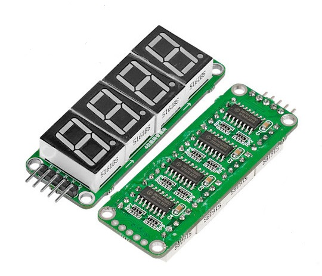

[Vietnamese version here!](./README_VI.md)

# Led7seg Counter with HC595 

Thiết kế bộ đếm 4 led 7 đoạn (0-9999). Giao tiếp Verilog qua ic thanh ghi dịch HC595.

## I. Tác giả

- **Name:** Võ Nhật Trường
- **Email:** truong92cdv@gmail.com
- **GitHub:** [truong92cdv](https://github.com/truong92cdv)

## II. Kết quả demo

https://github.com/user-attachments/assets/e14f3003-0783-4027-b96c-c62e5e2e1b5a

## III. Thiết bị

- ZUBoard 1CG mã XCZU1CG-1SBVA484E.
- 4 led7seg có tích hợp 4 ic HC595.
- 3 đường dây tín hiệu SRCLK, RCLK và SER; dây VCC +5V; dây GND.

